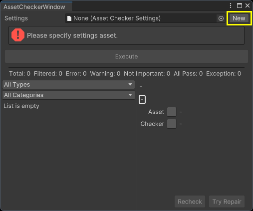

# Unity Asset Checking Tool

A user-friendly and extensible asset checking tool.


[中文](./README_CN.md)

## Features

- Supports multiple sets of check settings.
- Customizable asset scope for checking.
- Customizable check methods.
- Executes multiple check workflows on assets in a specified order.
- Filters check results by result type.
- Filters check results by custom categories.
- Allows re-checking of results.
- Attempts to execute repairs on check results.
- Supports custom details UI for check results.
- Restores previous check results when reopening the checker.
- Allows script-based initiation of check workflows independent of the UI.
- Supports multiple styles for check result UI.

## Supported Unity Versions

Unity 2021.3 or later.

In versions earlier than Unity 2022.3, some UI interaction features are slightly reduced but it does not affect usage.

## Installation

TODO

## How to Use

### Creating Asset Provider Assets

An Asset Provider is a subtype of `ScriptableObject` used to provide assets for the Asset Checker to check.

First, add a new type to your project that inherits from the `AssetProvider` class and implements the `GetAssets` method. This method should return an `IReadOnlyList<UnityEngine.Object>` containing the assets to be checked by the Asset Checker.

Next, create an instance of the Asset Provider asset for this type. Later, you will need to set this Asset Provider asset in the settings asset.

Example:

```csharp
using GBG.AssetChecking.Editor;
using System.Collections.Generic;
using UnityEngine;

[CreateAssetMenu(menuName = "Tests/My Asset Provider")]
public class MyAssetProvider : AssetProvider
{
    public override IReadOnlyList<Object> GetAssets()
    {
        // Return the list of assets to be checked
        return Resources.FindObjectsOfTypeAll<GameObject>();
    }
}
```

Built-in Asset Providers include:
- **ExplicitAssetProvider**: Returns assets explicitly specified by the user.
- **SelectionAssetProvider**: Returns assets currently selected in the Project window, with configurable filtering parameters.
- **TextSearchAssetProvider**: Returns assets found by searching for specific text content, similar to searching in the Project window.

You can create built-in Asset Provider assets through the _**Create/Asset Checker**_ menu.

### Creating Asset Checker Assets

Asset Checker is a subtype of `ScriptableObject` used to perform asset checking processes. It is **recommended** to implement only one check in each Asset Checker and combine multiple Asset Checkers to achieve complex check rules.

First, add a type to your project that inherits from the `AssetChecker` type and implements the `CheckAsset` and `RepairAsset` methods.

The `CheckAsset` method needs to implement the specific checking logic and return the check result of type `AssetCheckResult`. If the asset passes the check, you can return `null`, and this check result will not be recorded in the check result list.

The `RepairAsset` method needs to implement the logic to repair issues in the check result. If the check result cannot be repaired, you need to set the `repairable` field of the check result to `false` in the `CheckAsset` method.

Then create an Asset Checker asset of that type. Later, you will need to set this Asset Checker asset in the settings asset.

Example:

```csharp
using GBG.AssetChecking.Editor;
using UnityEngine;

[CreateAssetMenu(menuName = "Tests/My Asset Checker")]
public class MyAssetChecker : AssetChecker
{
    public override AssetCheckResult CheckAsset(Object asset)
    {
        GameObject go = asset as GameObject;
        if (!go)
        {
            // The Asset Checker will automatically generate a check result of type "Exception" for the thrown exception
            throw new System.ArgumentException("Asset must be an instance of type 'GameObject'.");
        }

        if (go.name.StartsWith("GO_"))
        {
            // For check results of type "AllPass", you can also return "null"
            return new AssetCheckResult
            {
                type = CheckResultType.AllPass,
                categories = new string[] { "GameObject" },
                title = "GameObject Name Prefix",
                details = "GameObject name prefix 'GO_' check passed.",
                asset = go,
                checker = this,
                repairable = true,
                customData = null,
                customViewId = null,
            };
        }

        return new AssetCheckResult
        {
            type = CheckResultType.Error,
            categories = new string[] { "GameObject" },
            title = "GameObject Name Prefix - Invalid",
            details = "GameObject name does not start with prefix 'GO_'.",
            asset = go,
            checker = this,
            repairable = true,
            customData = null,
            customViewId = null,
        };
    }

    public override void RepairAsset(AssetCheckResult checkResult, out bool allIssuesRepaired)
    {
        // The Asset Checker will automatically generate a check result of type "Exception" for the thrown exception
        throw new System.NotSupportedException("Issue cannot be repaired.");
    }
}
```

### Creating and Setting up Settings Assets

Open the Asset Checker window by selecting **_Tools/Bamboo/Asset Checker_** from the menu.

In the Asset Checker window, click the **New** button next to the **Settings** property to create a new settings asset (`AssetCheckerSettings`). Then assign this settings asset to the **Settings** property.



Select the settings asset and in the Inspector, assign the previously created Asset Provider asset to the **Asset Provider** property, and the Asset Checker asset to the **Asset Checkers** property. The **Asset Checkers** property can have multiple Asset Checker assets, which will be executed sequentially during the checking process.

In the Asset Checker window, click the **Execute** button to perform the checking process. The Asset Checker window will then display all the check results.

### Clear Check Results

Select the **Clear Check Results** option from the context menu in Asset Checker to clear the check results.

### Switch Result Icon Style

Select the **Result Icon Style** option from the context menu in Asset Checker to switch the icon style.

### Rechecking and Attempting to Repair Issues

Select a check result and click the **Recheck** button in the detailed information panel on the right to perform a recheck. Click the **Try Repair** button to attempt a repair. If the check result is marked as unrepairable, the **Try Repair** button will be disabled.

### Customizing Check Result Categories

You can specify categories for check results using the `AssetCheckResult.categories` field. Each check result can belong to multiple categories simultaneously.

### Custom Check Result Details UI

First, add a type to your project that inherits from the `CustomDetailsView` type. Implement the UI construction and `Bind` method in this type. In the `Bind` method, set up the UI based on the check result.

Next, add a type to your project that inherits from the `CustomViewProvider` type (`ScriptableObject`). Implement the `GetDetailsView` method in this type, which returns an instance of `CustomDetailsView` based on the `customViewId` parameter passed in. Create an asset of this type, the Custom View Provider asset, and assign it to the **Custom View Provider** property in the settings asset.

Finally, in the `AssetChecker.CheckAsset` method, set the corresponding keyword for `AssetCheckResult.customViewId`.

Example:

```csharp
using GBG.AssetChecking.Editor;
using UnityEngine;
using UnityEngine.UIElements;

[CreateAssetMenu(menuName = "Tests/My Custom Details View Provider")]
public class MyCustomDetailsViewProvider : CustomViewProvider
{
    public override CustomDetailsView GetDetailsView(string customViewId)
    {
        switch (customViewId)
        {
            case "MyCustomView":
                return new MyCustomDetailsView();
            default:
                throw new System.NotImplementedException();
        }
    }
}

public class MyCustomDetailsView : CustomDetailsView
{
    public override string CustomViewId => "MyCustomView";
    private readonly Label _detailsLabel;

    public MyCustomDetailsView()
    {
        _detailsLabel = new Label();
        Add(_detailsLabel);
    }

    public override void Bind(AssetCheckResult checkResult)
    {
        _detailsLabel.text = checkResult.details;
    }
}
```
