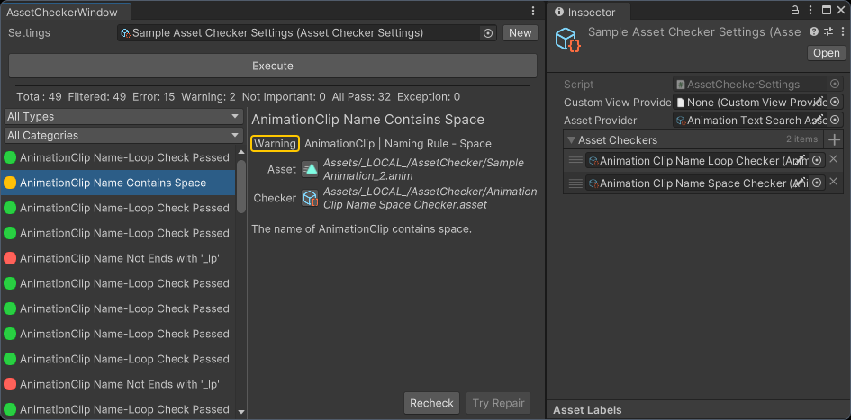

# Unity资产检查工具

易用且可扩展的资产检查工具。



[English](./README.md)

## 功能

- 支持多套检查配置
- 自定义要检查的资产范围
- 自定义检查方式
- 对资产顺序执行多个检查流程
- 按结果类型筛选检查结果
- 按自定义分类筛选检查结果
- 对检查结果执行重新检查
- 对检查结果尝试执行修复
- 为检查结果创建自定义详细信息UI
- 在重新打开检查器时，恢复上次检查的结果
- 允许脱离UI，使用脚本发起检查流程
- 支持多种检查结果UI样式

## 支持的Unity版本

Unity 2021.3 或更新版本。

在Unity 2022.3之前的版本中，部分UI交互功能有所减弱，但不影响功能。

## 安装

TODO

## 如何使用

### 创建Asset Provider资产

Asset Provider是 `ScriptableObject` 的子类型，用于向Asset Checker提供要进行检查的资产。

首先，在项目中添加一个类型，继承 `AssetProvider` 类型，实现 `GetAssets` 方法，该方法返回 `IReadOnlyList<UnityEngine.Object>` 。Asset Checker将会检查返回结果中的资产。

然后创建该类型的Asset Provider资产，稍后需要将该Asset Provider资产设置到配置文件中。

示例：
```csharp
using GBG.AssetChecker.Editor.AssetChecker;
using System.Collections.Generic;
using UnityEngine;

[CreateAssetMenu(menuName = "Tests/My Asset Provider")]
public class MyAssetProvider : AssetProvider
{
    public override IReadOnlyList<Object> GetAssets()
    {
        // 返回需要检查的资产列表
        return Resources.FindObjectsOfTypeAll<GameObject>();
    }
}
```

内置的资产Asset Provider:
- ExplicitAssetProvider：返回用户明确逐个指定的资产。
- SelectionAssetProvider：返回当前在Project窗口中选中的资产，可配置筛选参数。
- TextSearchAssetProvider：返回按给定文本内容搜索得到的资产，搜索结果与在Project窗口中搜索的结果相同。

可通过“Create/Asset Checker”菜单创建内置Asset Provider资产。

### 创建Asset Checker资产

Asset Checker是 `ScriptableObject` 的子类型，用于执行资产检查流程。建议每个Asset Checker中只实现一项检查，通过组合多个Asset Checker的方式实现复杂的检查规则。

首先，在项目中添加一个类型，继承 `AssetChecker` 类型，实现 `CheckAsset` 方法和 `RepairAsset` 方法。

`CheckAsset` 方法需要实现具体的检查逻辑，并返回 `AssetCheckResult` 类型的检查结果。如果资产检查通过，可以返回 `null` ，此时检查结果列表中不会记录此项检查结果。

`RepairAsset` 方法需要实现对检查结果中的问题进行修复的逻辑。如果检查结果不可修复，需要在 `CheckAsset` 方法中将检查结果的 `repairable` 字段设为 `false` 。

然后创建该类型的Asset Checker资产，稍后需要将该Asset Checker资产设置到配置文件中。

示例：
```csharp
using GBG.AssetChecker.Editor.AssetChecker;
using UnityEngine;

[CreateAssetMenu(menuName = "Tests/My Asset Checker")]
public class MyAssetChecker : AssetChecker
{
    public override AssetCheckResult CheckAsset(Object asset)
    {
        GameObject go = asset as GameObject;
        if (!go)
        {
            // Asset Checker会自动为抛出的异常生成“Exception”类型的检查结果
            throw new System.ArgumentException("Asset must be an instance of type 'GameObject'.");
        }

        if (go.name.StartsWith("GO_"))
        {
            // 对于“AllPass”类型的检查结果，也可以返回“null”
            return new AssetCheckResult
            {
                type = CheckResultType.AllPass,
                categories = new string[] { "GameObject" },
                title = "GameObject Name Prefix",
                details = "GameObject name prefix 'GO_' check passed.",
                asset = go,
                checker = this,
                repairable = true,
                customData = null,
                customViewId = null,
            };
        }

        return new AssetCheckResult
        {
            type = CheckResultType.Error,
            categories = new string[] { "GameObject" },
            title = "GameObject Name Prefix - Invalid",
            details = "GameObject name not starts with prefix 'GO_'.",
            asset = go,
            checker = this,
            repairable = true,
            customData = null,
            customViewId = null,
        };
    }

    public override void RepairAsset(AssetCheckResult checkResult, out bool allIssuesRepaired)
    {
        // Asset Checker会自动为抛出的异常生成“Exception”类型的检查结果
        throw new System.NotSupportedException("Issue can not be repaired");
    }
}
```

### 创建和设置配置文件资产

从菜单 “Tools/Bamboo/Asset Checker 打开资产检查工具窗口。

在Asset Checker窗口中，点击“Settings”属性右侧的“New”按钮，创建一个新的配置资产（`AssetCheckerSettings`），然后将该配置资产分配给“Settings”属性。

选中该配置资产，在Inspector中，将前面创建的Asset Provider资产和Asset Checker资产分别分配给“Asset Provider”属性和“Asset Checkers”属性。“Asset Checkers”属性可以添加多个Asset Checker资产，检查流程中，会顺序执行这些Asset Checker资产。

在Asset Checker窗口中，点击“Execute”按钮，执行检查流程。然后Asset Checker窗口中将会列出所有检查结果。

### 重新检查和尝试修复问题

选中一条检查结果，在右侧的详细信息面板中，点击“Recheck”按钮执行重新检查，点击“Try Repair”按钮执行修复。如果检查结果被标记为不可修复，“Try Repair”按钮会被禁用。

### 自定义检查结果类别

可以通过 `AssetCheckResult.categories` 字段为检查结果指定类别。每个检查结果可以同时属于多个类别。

### 自定义检查结果详情UI

首先，在项目中添加一个类型，继承 `CustomDetailsView` 类型，实现UI构建和 `Bind` 方法。 `Bind` 中要根据检查结果设置UI。

然后，在项目中添加一个类型，继承 `CustomViewProvider` 类型（ScriptableObject），实现 `GetDetailsView` 方法，该方法根据传入的 `customViewId` 参数返回 `CustomDetailsView` 实例。然后创建该类型的Custom View Provider资产，将该资产设置分配给配置文件的“Custom View Provider”属性。

最后，在 `AssetChecker.CheckAsset` 方法中，为 `AssetCheckResult.customViewId` 设置对应的关键字。

示例：
```csharp
using GBG.AssetChecker.Editor.AssetChecker;
using UnityEngine;
using UnityEngine.UIElements;

[CreateAssetMenu(menuName = "Tests/My Custom Details View Provider")]
public class MyCustomDetailsViewProvider : CustomViewProvider
{
    public override CustomDetailsView GetDetailsView(string customViewId)
    {
        switch (customViewId)
        {
            case "MyCustomView":
                return new MyCustomDetailsView();
            default:
                throw new System.NotImplementedException();
        }
    }
}

public class MyCustomDetailsView : CustomDetailsView
{
    public override string CustomViewId => "MyCustomView";
    private readonly Label _detailsLabel;

    public MyCustomDetailsView()
    {
        _detailsLabel = new Label();
        Add(_detailsLabel);
    }

    public override void Bind(AssetCheckResult checkResult)
    {
        _detailsLabel.text = checkResult.details;
    }
}
```